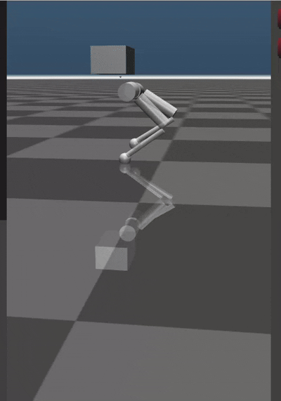

# Model Predictive Control for Bipedal Robot in MuJoCo Simulator



# Build Package
## Install ROS2
Option 1: Refer to [ROS2](https://ros.org/) official doc.

Option 2: Refer to [fishros](https://fishros.org.cn/forum/) (recommended)

Use ```wget http://fishros.com/install -O fishros && . fishros``` to install ros2

## Dependence
Pinocchio:
```bash
pip install pin
```

Proxsuite:
```bash
pip install proxsuite
```

Hpipm:

Please refer to [hpipm](https://github.com/giaf/hpipm) official doc to install it. 

## Build

```bash
cd ${source folder} 
colcon build
source install/setup.bash
```

Alternatively, ```echo "source ~/${source folder}/install/setup.bash" >> ~/.bashrc ```, do not forget to ```source ~/.bashrc```

# Run Package

## Run Controller
```bash
ros2 launch management management.launch.py 
```

## Run Simulation
```bash
ros2 launch sim sim.launch.py 
```


